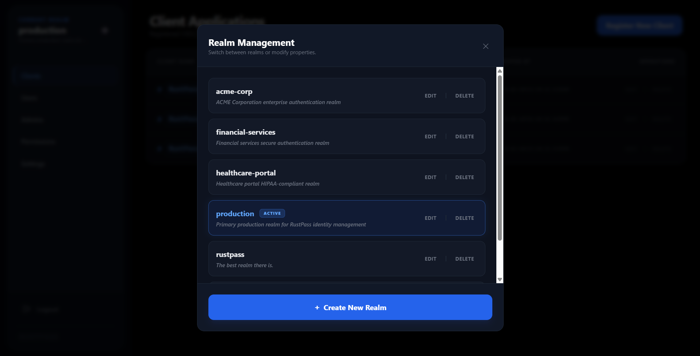
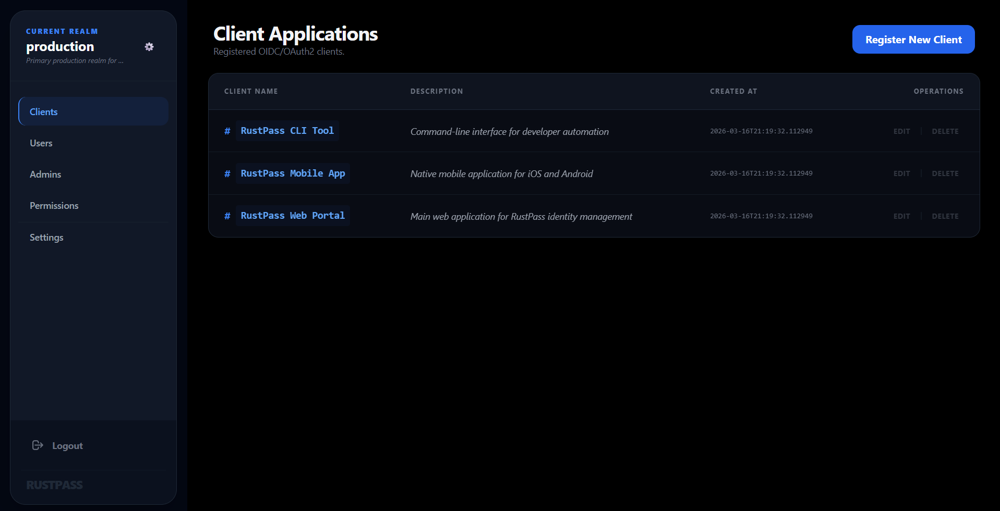
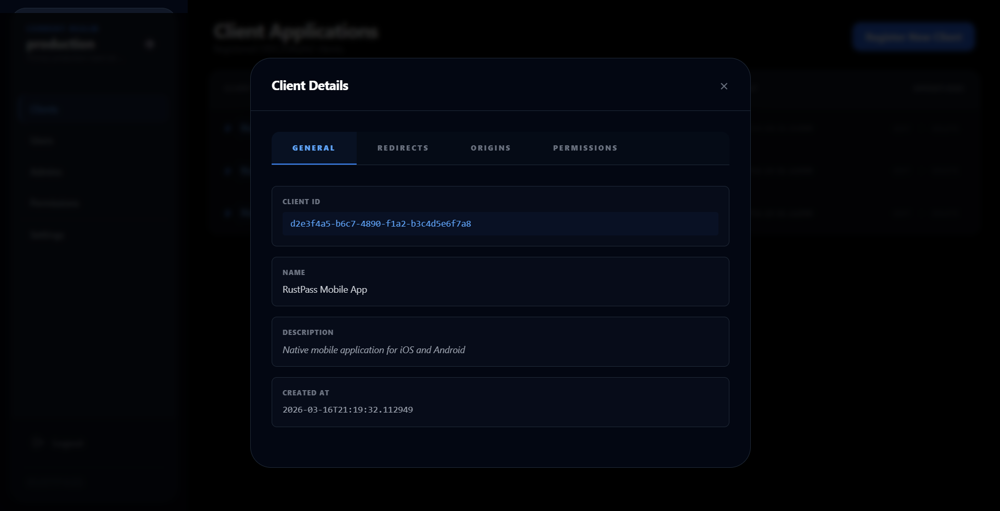
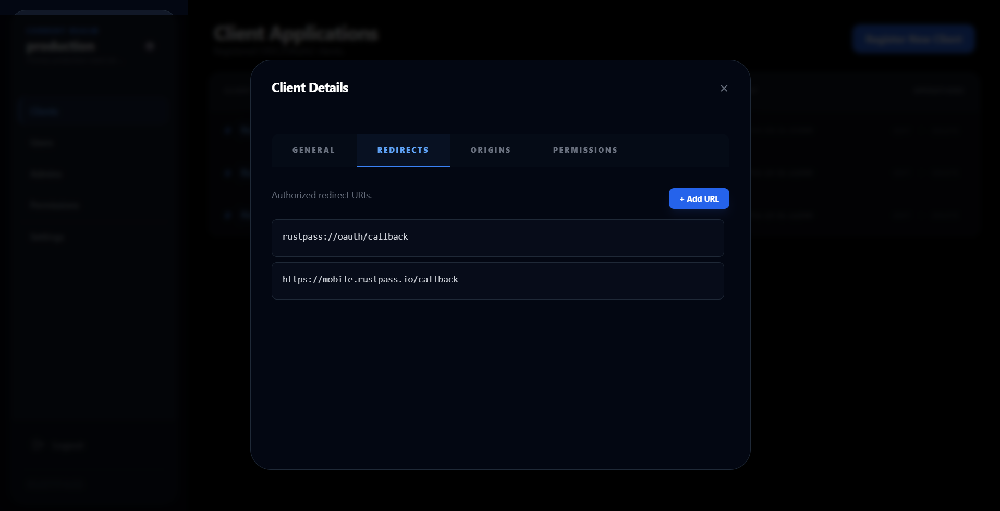
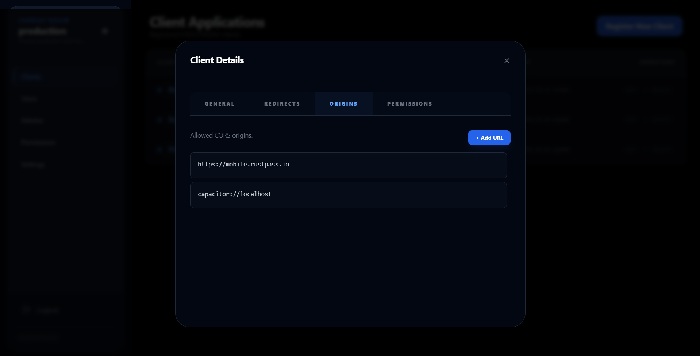
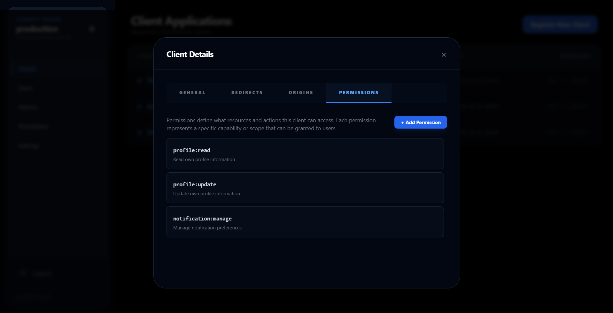
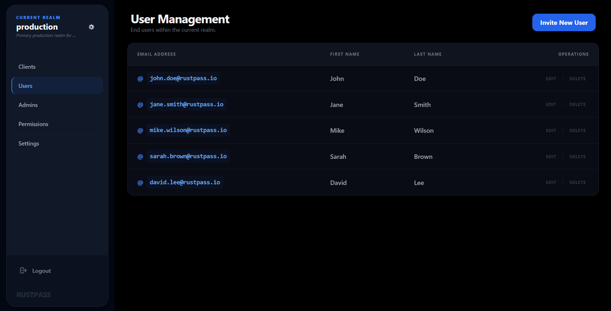
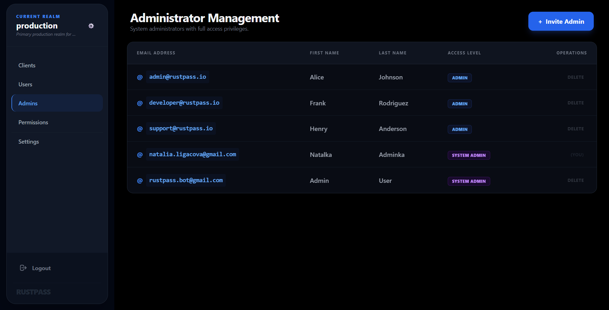
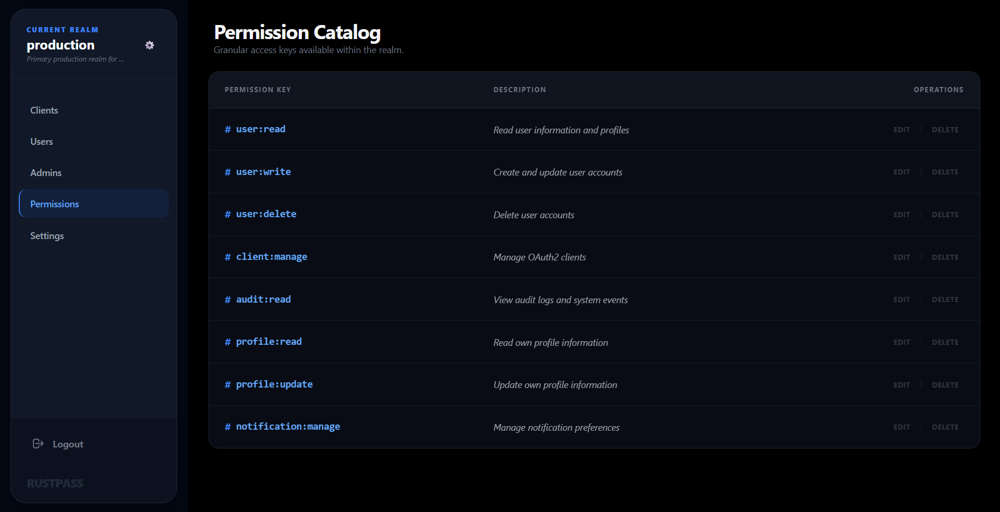

# RustPass

RustPass is a Rust-based identity and access management (IAM) system inspired by Keycloak. It provides a centralized solution for authentication, authorization, and user management across applications.

The project was developed as part of a university course PV281 Programming in Rust.

Note: The source code is not publicly available due to academic restrictions. Access can be provided upon request.

---

## Key Features

RustPass provides a set of core identity and access management capabilities:

- **Authentication**
    - User registration and login
    - JWT-based authentication and session handling

- **Client & Realm Management**
    - Configure clients, redirect URLs, and origin URLs
    - Organize permissions within isolated realms

- **User & Admin Management**
    - Create, update, and delete user accounts
    - Manage administrators within realms

- **Role-Based Access Control (RBAC)**
    - Assign permissions to users
    - Fine-grained access control across the system

- **Multi-Factor Authentication (MFA)**
    - Additional security layer for user authentication

- **Single Sign-On (SSO)**
    - Authenticate once and access multiple clients

---

## Tech Stack

### Backend

- **Rust**
- **Axum** (web framework)
- **Tokio** (asynchronous runtime)

### Data & Storage

- **PostgreSQL** (primary database)
- **deadpool-postgres** (connection pooling)
- **Redis** (caching and session management)

### Authentication & Security

- **JWT** for authentication
- **RSA key pairs** for token signing
- **TLS (rustls)** for secure HTTPS communication

### API & Communication

- **REST API**
- **OpenAPI (utoipa)** for API documentation

### Frontend

- **Yew**

### Additional Services

- **SMTP (lettre)** for email communication

---

## API

RustPass exposes a REST API documented using OpenAPI.

The API includes:

- Authentication endpoints (login, refresh, identity)
- User management
- Realm management
- Client configuration
- Permission and RBAC management

You can explore it here:

https://nataalka.github.io/rustpass/

---

## Screenshots

